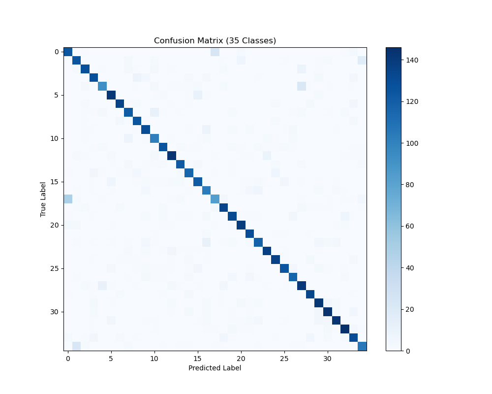
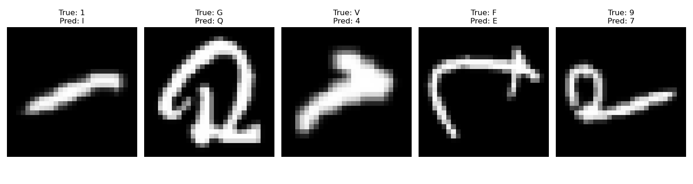

# Character Recognition Neural Network (NumPy-Only)
**B.E. Computer Science and Engineering (AI/ML) | CIT Chennai**

## 1.0 Project Objective
The goal of this assignment is to build a multi-class neural network entirely from scratch using only NumPy, completely avoiding frameworks like TensorFlow or PyTorch[cite: 1]. The network is designed to classify 35 distinct alphanumeric classes (digits 1-9 and uppercase letters A-Z)[cite: 1]. Building this from the ground up demonstrates a practical understanding of the core mathematics behind forward propagation, activation layers, and gradient descent optimization[cite: 1].

## 2.0 Step-by-Step Implementation Methodology
The implementation was divided into four distinct phases to satisfy all data preparation and mathematical requirements[cite: 1].

### Phase 1: Data Preparation Pipeline
1. **Dataset Extraction:** The EMNIST "ByClass" dataset was utilized. To optimize memory footprint and execution speed, a custom Python script parsed the raw dataset line-by-line.
2. **Filtering & Sampling:** The script dynamically filtered out the digit '0' and all lowercase letters to isolate the target classes[cite: 1]. Exactly 1,000 samples were extracted for each of the 35 classes (exceeding the 50-sample minimum), yielding a dataset of 35,000 images[cite: 1].
3. **Preprocessing:** The 28x28 pixel images were flattened into fixed-size 1D arrays of 784 features[cite: 1]. Pixel intensities were normalized by dividing by 255.0 to scale values between 0 and 1, ensuring stable gradient descent[cite: 1].
4. **Data Splitting:** The final dataset was randomly shuffled and split into three sets: 70% Training, 15% Validation, and 15% Testing[cite: 1]. Labels were converted to one-hot encoded vectors.

### Phase 2: Neural Network Construction
1. **Architecture Definition:** A two-layer Multi-Layer Perceptron (MLP) was defined with an input layer (784 neurons), one hidden layer (256 neurons), and an output layer (35 neurons).
2. **Parameter Initialization:** Weight matrices were initialized using small random values to break symmetry, ensuring neurons learn distinct features. Bias vectors were initialized to zero.
3. **Activation Function Implementation:** A Rectified Linear Unit (ReLU) was implemented for the hidden layer to introduce non-linearity[cite: 1]. A Softmax function, stabilized by subtracting the maximum Z value to prevent exponential overflow, was implemented for the output layer[cite: 1].

### Phase 3: Training & Validation Execution
1. **Training Loop:** The model iterated over the training data for 500 epochs with a learning rate of 0.5. Each epoch strictly executed forward propagation, categorical cross-entropy loss calculation, backpropagation, and parameter updates sequentially[cite: 1].
2. **Validation Loop:** At the conclusion of every epoch, a validation loop evaluated the model's generalization capabilities on unseen data by passing it through forward propagation without updating the network's weights[cite: 1].
3. **Metric Tracking:** Loss and accuracy metrics were documented iteratively for both splits[cite: 1]. The final trained parameters were saved as NumPy `.npy` files.

## 3.0 Objective of Network Components
Detailed docstrings are included in the `neural_network.py` source code to explain each module[cite: 1]. A summary of component objectives is below[cite: 1]:

* **`init_params`**: Establishes the initial trainable parameters required for forward and backward propagation. 
* **`forward_propagation`**: Passes the input data batch through the hidden and output layers via dot products[cite: 1]. Generates final predictions and stores intermediate matrices in a cache required for backpropagation.
* **`relu` & `softmax`**: Activation functions[cite: 1]. ReLU introduces non-linearity to learn complex patterns. Softmax converts raw output scores into a normalized probability distribution across 35 classes[cite: 1].
* **`compute_loss`**: Calculates the categorical cross-entropy loss, quantifying the aggregate error between the true labels and predicted probabilities[cite: 1].
* **`back_propagation`**: Executes the backward pass using matrix calculus[cite: 1]. Computes gradients to determine the necessary direction and magnitude of weight adjustments.
* **`update_parameters`**: Applies gradient descent optimization[cite: 1]. Subtracts calculated gradients from current weights to systematically minimize the network's error.

## 4.0 Analysis and Final Metrics
The network completed training with a final **Training Accuracy of 87.12%** and a **Validation Accuracy of 83.81%**.

### Visual Analysis
*(Note: Visuals are rendered from the output of `analysis.py`)*

**Confusion Matrix:**

The confusion matrix demonstrates a strong true-positive diagonal line, confirming consistent classification capability across the 35 distinct classes[cite: 1].

**Incorrect Predictions:**

Error analysis of at least 5 incorrect predictions revealed structural limitations inherent to flattening 2D topological data into 1D arrays[cite: 1]. Specific failures include:
* **True 1, Pred I:** The model confused a straight-line '1' with an un-serifed capital 'I' because their active pixel zones overlap perfectly when flattened.
* **True G, Pred Q:** The circular body and internal stroke of the handwritten 'G' mimic the closed loop and tail of a 'Q'.
* **True V, Pred 4:** The jagged angle of the handwritten 'V' created dense pixel clusters that the network falsely associated with the intersecting cross-strokes of a '4'.
* **True F, Pred E:** Structurally identical except for the bottom horizontal stroke; the model over-weighted the vertical spine and failed to register the missing bottom stroke.
* **True 9, Pred 7:** The dominant straight tail of this messy '9' triggered the primary structural features of a '7', overpowering the poorly drawn loop at the top.

## 5.0 Repository Structure
* `dataset_prep.py`: Extracts and normalizes data from the EMNIST dataset[cite: 1].
* `data_split.py`: Handles shuffling and Train/Val/Test splitting[cite: 1].
* `neural_network.py`: Core mathematical components and required docstrings[cite: 1].
* `train.py`: The execution loop generating the final `.npy` weight files[cite: 1].
* `analysis.py`: Evaluates the model against testing data to produce the charts and matrices above[cite: 1].
